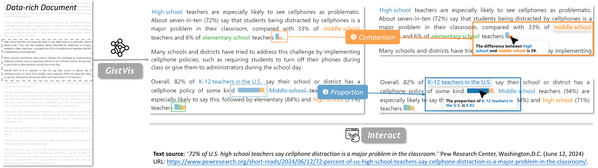

# GistVis

[](https://github.com/prettier/prettier)



GistVis is a proof-of-concept research prototype that aims to provide in-situ augmentation of data-rich documents. GistVis blends the power of Large Language Model (LLM) and Visualization Design Knowledge to automatically generate word-scale visualizations (WSV) within documents.

GistVis is also actively evolving as the technical toolchain evolves (prototype implementation in `releases/gistvis-prototype` branch). Building on the research prototype's modular design, our team's immediate next step is separating and improving the WSV module into a React component library to facilitate research and application with WSVs. We welcome constructive criticisms and contributions.

## Using GistVis

We are working on publisishing a website for our project. Stay tuned!

## Citing GistVis

If you find GistVis useful, please cite our paper: 

```bib
@article{zou2025gistvis,
    title = {GistVis: Automatic Generation of Word-scale Visualizations from Data-rich Documents},
    author = {Zou, Ruishi and Tang, Yinqi and Chen, Jingzhu and Lu, Siyu and Lu, Yan and Yang, Yingfan and Ye, Chen},
    journal = {arXiv preprint arXiv:2502.03784},
    year = {2025}
}
```

> This work is currently conditionally accepted to ACM CHI 2025.
